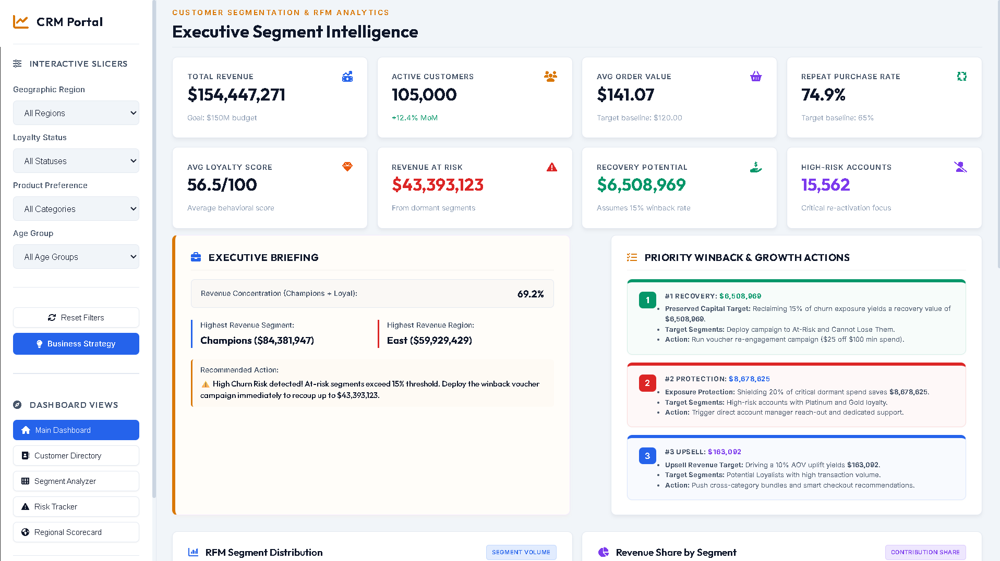

# Customer Segmentation & CRM Analytics Dashboard (RFM Model)

📅 **Data Coverage:** 105,000 Customer Records

💻 **Interactive Portal:** [Live Dashboard (GitHub Pages)](https://your-github-pages-link)

📂 **Executive Deliverable:** [Strategic Business Analysis Report (Print/PDF)](https://girishshenoy16.github.io/sales-forecasting-revenue-trend-analysis/preview_report.html)

---



---

> [!IMPORTANT]
> **FY2026 Executive Customer Growth Directives**
>
> 1. Protect **$43.4M Revenue At Risk** currently concentrated within dormant and churn-prone customer segments.
> 2. Launch targeted win-back campaigns capable of recovering **$6.5M+ incremental revenue**.
> 3. Increase Average Order Value (AOV) through cross-sell and upsell initiatives targeting Potential Loyalists.
> 4. Strengthen retention programs for Champions contributing **54.6% of total revenue**.
> 5. Prioritize high-risk customer intervention to reduce future churn exposure.

---

# 1. Project Objective

The objective of this project is to build an executive-grade Customer Relationship Management (CRM) Analytics Dashboard powered by RFM (Recency, Frequency, Monetary) segmentation.

The solution simulates the customer intelligence platforms used by leading organizations to monitor customer health, identify churn risks, optimize retention strategies, improve customer lifetime value, and support executive decision-making through interactive analytics.

---

# 2. Business Problem

Customer acquisition costs continue to rise while customer retention remains the largest driver of long-term profitability.

Without structured customer segmentation:

* Marketing campaigns become inefficient due to one-size-fits-all messaging.
* High-value customers churn without triggering early warning systems.
* Leadership teams lack visibility into customer revenue concentration and risk exposure.
* Retention budgets are allocated without understanding customer lifetime value.

Stakeholders require:

1. Accurate customer classification based on purchase behavior.
2. Quantifiable measurement of revenue exposure.
3. Early identification of churn-prone VIP customers.
4. Actionable retention and win-back strategies.
5. Regional customer intelligence for resource allocation.

---

# 3. Business Value Delivered

This solution identified:

| Business Outcome                  | Value    |
| --------------------------------- | -------- |
| Revenue At Risk                   | $43.4M   |
| Recovery Opportunity              | $6.5M    |
| High-Risk Accounts                | 15,562   |
| Revenue Concentration (Champions) | 54.6%    |
| Repeat Purchase Rate              | 74.9%    |
| Average Loyalty Score             | 56.5/100 |

The dashboard enables executives to prioritize retention initiatives, optimize marketing investments, and maximize customer lifetime value through data-driven segmentation.

---

# 4. Repository & Project Structure

```text
Customer Segmentation using RFM Model/
├── data/
│   ├── raw_customer_transactions.csv        # Raw customer transaction history (105k records)
│   └── customer_rfm_segmented.csv          # Processed customer database with RFM segments
├── scripts/
│   ├── generate_raw_data.py                 # Generates the 105k customer database
│   └── rfm_analysis.py                      # Performs RFM math and exports dashboard data
├── docs/                                    # Target directory for GitHub Pages hosting
│   ├── index.html                           # Main dashboard structure (runs in any browser)
│   ├── Business_Recommendations_Report.md   # Actionable cohort marketing plans
│   ├── css/
│   │   └── style.css                        # Polished CRM dark-slate styling
│   ├── js/
│   │   └── main.js                          # Controls interactive filters & Chart.js plots
│   └── data/
│       └── dashboard_data.js                # Compiled JSON-like dataset generated from Python
├── reports/
│   ├── Detailed_Project_Report.md           # Business and data methodology overview
│   └── Business_Recommendations_Report.md   # Duplicate copy of cohort marketing plans
├── requirements.txt                         # Python packages (pandas, numpy, openpyxl, etc.)
└── README.md                                # Portfolio README
```

---

# 5. Dataset Overview

The analysis processes **105,000 customer accounts** distributed across four major geographic regions.

| Region | Revenue | Revenue Share |
| ------ | ------- | ------------- |
| East   | $59.9M  | 38.8%         |
| West   | $45.9M  | 29.7%         |
| North  | $31.0M  | 20.1%         |
| South  | $17.6M  | 11.4%         |

### Key Fields

* Customer ID
* Last Purchase Date
* Order Count
* Total Spend
* Average Order Value (AOV)
* Geographic Region
* Loyalty Status
* RFM Segment

---

# 6. Key Performance Indicators (KPIs)

| KPI                   | Formula                                  | Business Purpose                      |
| --------------------- | ---------------------------------------- | ------------------------------------- |
| Total Revenue         | Sum(Customer Spend)                      | Measures overall business performance |
| Active Customers      | Count(Active Customers)                  | Tracks engagement levels              |
| Average Order Value   | Revenue ÷ Orders                         | Measures purchasing efficiency        |
| Repeat Purchase Rate  | Repeat Customers ÷ Total Customers       | Evaluates retention effectiveness     |
| Revenue At Risk       | Revenue from At-Risk Segments            | Measures exposed revenue              |
| Recovery Potential    | Revenue At Risk × 15%                    | Estimates win-back opportunity        |
| Loyalty Score         | Weighted RFM Index                       | Measures customer quality             |
| Revenue Concentration | Revenue from Champions & Loyal Customers | Evaluates dependency risk             |

---

# 7. RFM Segmentation Methodology

The dashboard uses the industry-standard RFM Framework.

### Recency (R)

Measures how recently a customer made a purchase.

### Frequency (F)

Measures how often a customer purchases.

### Monetary (M)

Measures total lifetime customer spend.

Customers receive weighted RFM scores and are automatically assigned to strategic customer segments.

---

# 8. Customer Segment Breakdown

| Segment             | Revenue Contribution | Strategic Objective   |
| ------------------- | -------------------- | --------------------- |
| Champions           | $84.3M               | Retain & Reward       |
| Loyal Customers     | $22.5M               | Protect               |
| Potential Loyalists | $18.3M               | Upsell & Grow         |
| New Customers       | $6.9M                | Onboard & Nurture     |
| At Risk             | $593K                | Recover               |
| Cannot Lose Them    | $42.8M               | Immediate Retention   |
| Hibernating / Lost  | $8.4M                | Low-Cost Reactivation |

### Segment Insights

**Champions (24.8% of customer base)**
Recent, highly engaged, and highest-spending customers. Contribute 54.6% of total revenue.

**Potential Loyalists (15.2% of customer base)**
Strong candidates for cross-selling and loyalty program expansion.

**At-Risk & Cannot Lose Them Segments**
Represent over $43M in revenue exposure and require immediate intervention.

---

# 9. Analytics & Modeling

### Data Engineering

* Customer transaction simulation
* Regional revenue distribution modeling
* Revenue concentration controls
* Customer behavior generation

### Customer Analytics

* RFM Segmentation
* Loyalty Scoring
* Revenue Risk Assessment
* Customer Lifetime Value Analysis
* Retention Opportunity Analysis

### Executive Metrics

* Revenue At Risk
* Recovery Potential
* Loyalty Score
* Repeat Purchase Rate
* Segment Revenue Share
* Regional Revenue Contribution

---

# 10. Dashboard Features

### Executive Dashboard

* Boardroom KPI Cards
* Executive Briefing
* Strategic Recommendations
* Revenue Risk Monitoring

### Customer Directory

* Searchable customer database
* Loyalty segmentation
* Customer spend analysis

### Segment Opportunity Matrix

* Segment prioritization
* Revenue contribution analysis
* Campaign recommendations

### Risk Tracker

* Churn exposure monitoring
* High-risk customer identification
* Revenue recovery opportunities

### Regional Scorecard

* Geographic performance tracking
* Revenue concentration analysis
* Regional customer intelligence

---

# 11. Executive Insights

### Revenue Concentration Risk

Champions and Loyal Customers generate approximately 69% of total revenue, creating concentration risk if retention programs are not maintained.

### Revenue Recovery Opportunity

The business currently has $43.4M in revenue exposed to churn risk.

A targeted 15% win-back campaign can recover approximately $6.5M.

### High-Value Customer Protection

The "Cannot Lose Them" segment contributes $42.8M in revenue and requires immediate retention initiatives.

### Geographic Leadership

The East region leads with 38.8% revenue share and the highest customer concentration.

### Growth Opportunity

Potential Loyalists represent the strongest opportunity for cross-sell and upsell campaigns.

---

# 12. Strategic Recommendations

### 1. VIP Retention Program

Deploy exclusive loyalty benefits for Champions and Loyal Customers.

**Expected Outcome**

* Increased retention
* Higher customer lifetime value
* Reduced churn risk

---

### 2. Win-Back Campaign

Launch targeted email and voucher campaigns for At-Risk customers.

**Expected Outcome**

* Recover up to $6.5M in dormant revenue
* Improve customer reactivation rates

---

### 3. Cross-Sell Strategy

Target Potential Loyalists with personalized product bundles.

**Expected Outcome**

* Higher AOV
* Increased purchase frequency

---

### 4. Regional Expansion Strategy

Replicate successful East region campaigns in underperforming markets.

**Expected Outcome**

* Improved regional performance
* Balanced revenue growth

---

# 13. Executive Impact

This project simulates how CRM, Revenue Operations, Customer Success, and Marketing Leadership teams monitor customer health and retention performance.

### Key Business Outcomes

* Churn Risk Identification
* Revenue Protection
* Customer Lifetime Value Growth
* Loyalty Program Optimization
* Geographic Performance Analysis
* Customer Retention Strategy
* Executive Decision Support

---

# 14. Technology Stack

### Data Engineering

* Python
* Pandas
* NumPy

### Analytics

* RFM Segmentation
* Customer Analytics
* Retention Analysis
* Churn Risk Modeling

### Visualization

* HTML5
* CSS3
* JavaScript
* Chart.js

### Deployment

* GitHub Pages

---

# 15. Business Analyst Skills Demonstrated

* Customer Segmentation
* CRM Analytics
* Business Intelligence
* Customer Retention Analysis
* Churn Risk Analysis
* Revenue Analytics
* KPI Development
* Data Storytelling
* Marketing Analytics
* Executive Dashboard Design
* Strategic Recommendations

---

# 16. Local Execution Guide

```bash
git clone https://github.com/girishshenoy16/customer-segmentation-crm-analytics-dashboard.git

cd customer-segmentation-crm-analytics-dashboard

python -m venv .venv

source .venv/bin/activate

pip install -r requirements.txt

python scripts/generate_customer_data.py
python scripts/rfm_analysis.py
```

Open:

```text
docs/index.html
```

in your browser.

---