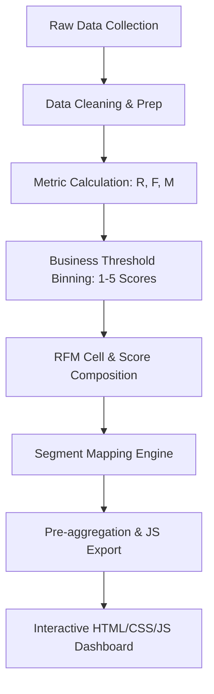

# Detailed Project Report: Customer Segmentation using RFM Model

---

## 🖥️ Executive Dashboard Preview

*Note: Dashboard preview showcasing interactive filters, dynamic KPI cards, and RFM segment distributions. (Screenshot placeholder, to be updated later).*

---

## 📂 Project Folder Structure

```text
Customer Segmentation using RFM Model/
├── data/
│   ├── raw_customer_transactions.csv        # Raw customer transaction history (105k records)
│   └── customer_rfm_segmented.csv          # Processed customer database with RFM segments
├── scripts/
│   ├── generate_raw_data.py                 # Generates the 105k customer database
│   └── rfm_analysis.py                      # Performs RFM math and exports dashboard data
├── docs/                                    # Target directory for GitHub Pages hosting
│   ├── index.html                           # Main dashboard structure (runs in any browser)
│   ├── Business_Recommendations_Report.md   # Actionable cohort marketing plans
│   ├── css/
│   │   └── style.css                        # Polished CRM dark-slate styling
│   ├── js/
│   │   └── main.js                          # Controls interactive filters & Chart.js plots
│   └── data/
│       └── dashboard_data.js                # Compiled JSON-like dataset generated from Python
├── reports/
│   ├── Detailed_Project_Report.md           # Business and data methodology overview
│   └── Business_Recommendations_Report.md   # Duplicate copy of cohort marketing plans
├── requirements.txt                         # Python packages (pandas, numpy, openpyxl, etc.)
└── README.md                                # Portfolio README
```

---

## 1. Executive Summary & Project Background

### What This Project Is
This project is an industry-grade, end-to-end customer analytics solution. It leverages transaction history data of over 105,000 customers to categorize them into distinct, actionable behavioral cohorts. By implementing a **Recency, Frequency, and Monetary (RFM) model**, this project simulates how real-world marketing and product teams identify high-value spenders, save at-risk accounts, and design hyper-personalized campaigns.

### What RFM Means
RFM is a behavioral segmentation framework used to analyze customer value based on three quantitative factors:
1. **Recency (R)**: *How recently did the customer purchase?* (Measured as days between the last transaction and a reference analysis date).
2. **Frequency (F)**: *How often do they purchase?* (Measured as the count of transactions over a set timeline).
3. **Monetary (M)**: *How much money do they spend?* (Measured as the sum of purchase values across transactions).

### Why Customer Segmentation is Critical
In modern business, treat-all-customers-same models fail. Customer segmentation is important because:
* **Efficiency**: It avoids wasting marketing budget on low-value or completely lost leads.
* **Retention**: It helps teams deploy win-back campaigns *before* a customer churns.
* **Upselling**: It targets potential loyalists with product upgrades and high-margin bundles.

### How Companies Use RFM Analysis
E-commerce and retail giants (like Amazon, Myntra, Swiggy, Nykaa, and Zomato) run daily RFM jobs. These segments trigger automated CRM flows:
* **Champions** receive invitations to VIP clubs with zero shipping fees.
* **At-Risk Spenders** are targeted with high-value push notifications (e.g., "We miss you, here is 20% off!").
* **New Customers** enter onboarding email flows explaining product benefits to drive a second purchase.

### Target Job Roles
This project directly demonstrates capabilities required in high-growth analytical roles:
* **Business Analyst**: Translating data patterns into growth strategies.
* **CRM Analyst / Loyalty Manager**: Managing cohorts, coupons, and lifetime engagement.
* **Marketing Analyst**: Measuring retention, campaign ROI, and customer acquisition costs.
* **Customer Insights Analyst / Data Analyst**: Writing ETL pipelines and constructing executive dashboards.

---

## 2. Business Problem Definition
A growing multi-category retailer suffers from:
1. **Untargeted Marketing Campaigns**: Blasting the entire customer base with generic 10% discount codes, eroding margins on high-value customers who would have bought anyway, and failing to engage dormant users.
2. **Rising Customer Churn**: High customer acquisition costs (CAC) with flat retention rates, indicating customers buy once and do not return.
3. **Lack of Lifecycle Vision**: Leadership cannot isolate the top high-value cohorts that drive the majority of top-line revenue, leaving them vulnerable to competitor campaigns.

**Objective**: Segment the customer base into behavioral cohorts based on RFM scores, analyze their revenue contributions, and build a static web dashboard for executive monitoring.

---

## 3. Data Dictionary
The project operates on two main data tables: `raw_customer_transactions.csv` (the input) and `customer_rfm_segmented.csv` (the processed output).

### Raw Transaction Schema
* **Customer ID**: Unique identifier (`CUST-000001` to `CUST-105000`).
* **Customer Name**: Dynamically generated full names.
* **Region**: Geographical territory (`East`, `West`, `North`, `South`).
* **Age Group**: Customer age cohorts (`18-24`, `25-34`, `35-44`, `45-54`, `55+`).
* **Gender**: Customer self-identification (`Male`, `Female`, `Non-binary`).
* **Customer Join Date**: Date of account registration.
* **Last Purchase Date**: Date of the last transaction.
* **Total Orders (F)**: Count of purchases.
* **Total Purchase Amount (M)**: Sum of all spending (includes regional spend multipliers).
* **Average Order Value (AOV)**: Total purchase amount divided by total orders.
* **Product Category Preference**: Top category spent on (`Electronics`, `Apparel`, `Home & Kitchen`, `Beauty`, `Sports`).
* **Loyalty Status**: Tier based on cumulative spending (realistic thresholds):
  * **Platinum**: Spend $\ge \$3,500$
  * **Gold**: Spend $\$1,200 - \$3,499$
  * **Silver**: Spend $\$250 - \$1,199$
  * **Bronze**: Spend $<\$250$

### Processed RFM Schema
* **Recency (Days)**: Days since last purchase: $\text{Recency} = \text{Reference Date} - \text{Last Purchase Date}$.
* **Recency Score (R)**: 1 to 5 scale based on business thresholds.
* **Frequency Score (F)**: 1 to 5 scale based on transaction frequency.
* **Monetary Score (M)**: 1 to 5 scale based on cumulative purchase spend.
* **RFM Cell**: Concatenated score string (e.g. `"555"` represents R=5, F=5, M=5).
* **RFM Score**: Sum of R, F, and M scores (range: 3 to 15).
* **Customer Segment**: Final business classification based on the RFM matrix.

---

## 4. RFM Methodology Step-by-Step



### Step 1: Metric Calculation
* **Recency (Days)**: Calculated for each customer relative to the reference date `June 13, 2026`.
* **Frequency**: Extracted directly from total historical orders.
* **Monetary**: Extracted directly from cumulative order spend.

### Step 2: Scoring via Business Thresholds (1 to 5)
To ensure realistic segment sizes and reflect operational logic, we use specific business-driven bins:
* **Recency Score**: `1-30 days -> 5`, `31-75 days -> 4`, `76-180 days -> 3`, `181-365 days -> 2`, `365+ days -> 1`.
* **Frequency Score**: `1 order -> 1`, `2 orders -> 2`, `3-5 orders -> 3`, `6-12 orders -> 4`, `13+ orders -> 5`.
* **Monetary Score**: `<$100 -> 1`, `$100-$299 -> 2`, `$300-$799 -> 3`, `$800-$2499 -> 4`, `>=$2500 -> 5`.

### Step 3: Segment Mapping
We apply the business logic mapping to segment customers:

| R Score | F Score | M Score | Final Mapped Segment | Business Persona |
| :---: | :---: | :---: | :--- | :--- |
| 4-5 | 4-5 | 4-5 | **Champions** | High-value, buy weekly, brand advocates |
| 3-5 | 3-5 | 3-5 | **Loyal Customers** | Steady spenders, responsive to campaigns |
| 4-5 | 2-3 | 2-3 | **Potential Loyalists** | Active, higher than average spend, needs push |
| 4-5 | 1 | 1-2 | **New Customers** | First-time buyers, needs onboarding |
| 3-4 | 1-2 | 1-3 | **Promising/Need Attention** | Average recency, low spend, neutral engagement |
| 1-2 | 3-5 | 3-5 | **At-Risk** | Formerly loyal spenders, inactive for 100+ days |
| 1-2 | 4-5 | 4-5 | **Cannot Lose Them** | High-value whales who are about to churn |
| 1-2 | 1-2 | 1-2 | **Hibernating/Lost** | Dormant for 300+ days, low orders and spend |
| - | - | - | **About to Sleep** | Average performers slipping into inactivity |

---

## 5. Analytical Metrics & Calculations

### Recency (Days)
$$\text{Recency} = T_{\text{analysis}} - T_{\text{last\_purchase}}$$

### Average Order Value (AOV)
$$\text{AOV} = \frac{\sum \text{Total Spend}}{\sum \text{Total Orders}}$$
*AOV measures the typical transaction size. Calculated AOV: **$141.07**.*

### Repeat Purchase Rate (RPR)
$$\text{RPR} = \frac{\text{Customers with } \ge 2 \text{ Transactions}}{\text{Total Unique Customers}} \times 100$$
*Shows the health of customer loyalty. Calculated RPR: **74.90%**.*

### Segment-wise Revenue Contribution %
$$\text{Revenue Contribution \%} = \frac{\sum \text{Spend in Segment } S}{\text{Total Company Revenue}} \times 100$$
*Champions constitute **24.8%** of the customer base but drive **54.6%** of company revenue.*

### Customer Loyalty Score
$$\text{Loyalty Score} = \frac{\text{Loyalty Points Sum}}{\text{Total Unique Customers}}$$
*Calculated index based on loyalty tiers: Platinum (95), Gold (78), Silver (55), Bronze (30). Calculated Loyalty Score: **56.48/100**.*

---

## 6. Business Insights Summary
By running this analysis on 105,000 retail records, we identify:
1. **Revenue Concentration**: Champions and Loyal Customers constitute roughly **42.7% of the customer base** but drive **69.2%** of the total revenue ($106.9M). Protecting this segment is our highest priority.
2. **At-Risk Capital**: The "Cannot Lose Them" and "At-Risk" segments represent substantial past revenue ($43.4M locked in dormant accounts). Re-engaging these customers is 5x cheaper than acquiring new ones.
3. **Recovery Potential**: By targeting dormant high-value customers with a reactivation campaign ($25 off $100 winback vouchers), and assuming a realistic 15% success rate, the business has a recovery opportunity of **$6.51M** in otherwise lost revenue.
